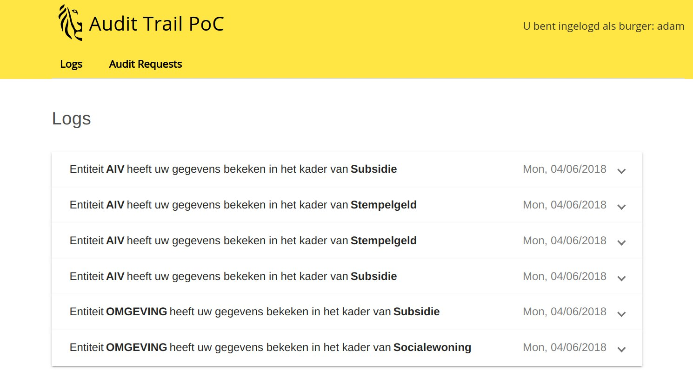

# Audit-trail

**Audit-trail** is a Proof-of-Concept (PoC) for the [Flemish Government](https://www.vlaanderen.be/nl) to demonstrate how early-stage blockchain technologies can be leveraged to create a decentralized and immutable logging-system allowing for:
- Transparent reporting to citizens.
- The ability to dispute government's access behaviour, by citizens.
- Enriched and accurate auditing of logs and disputes.

Two popular blockchain technologies came into consideration during this PoC: [Ethereum](https://www.ethereum.org/) and [HyperLedger Fabric](https://www.hyperledger.org/projects/fabric).

This project was requested by [Department Environment](https://www.omgevingvlaanderen.be/) and funded by [Agentschap Informatie Vlaanderen](https://overheid.vlaanderen.be/informatie-vlaanderen/), both part of the Flemish Government.

## Motivation

The Flemish Government (Vlaamse Overheid) is seeking ways to innovate and empower its citizens with ownership of their personal data. As in other governments, the civilian's personal data is usually located in a centralized database. A government process in need of your personal data (your age, your family composition, ...) will access this data and log the access. These access logs are stored internally for audit purposes. 

The main idea is to make these logs available and returning the information to the citizens through an online portal, providing citizens with an overview of which parts of their personal data is being used and in which government process or context. A few applications have been or are being developed within this mindset, including [MAGDA](https://overheid.vlaanderen.be/magda) and [Burgerprofiel](https://overheid.vlaanderen.be/mijn-burgerprofiel). Both have their strengths and weaknesses.

With the rise of blockchain technologies, The Flemish Government is investing in innovative blockchain projects to **investigate and test** how the technology can help shape the future of data and privacy and build a decentralized and transparent government.

## Concepts

### Last of Chain

If you can't trust logs, they lose their evidence value. Logs should not be modifiable and it should not be possible to temporarily disable logging. That's why blockchain technologies come to mind as they allow for an immutable, consensus-driven, distributed single source of truth.

However, at the moment of writing this documentation page, the current processes at the Flemish government access personal data first and log later. Furthermore, personal data access and logging are 2 separate systems, which means that the logging system could be turned-off for a few minutes, if someone would have malicious intents.

We'll be calling this scheme a **Last of Chain** logging system, as the logging system is literally the last piece of the data-chain, registering what happened before it.

### First of Chain

Another approach is to integrate the database with sensitive data and the logging into a single component, essentially making the logging **First of Chain**.

This type of solutions already exist. For example, popular databases like MySQL and Postgresql allow for logging directly by the database itself, which would eliminate this problem. However in these systems, the logs are usually encoded in plain-text, they are not immutable nor protected. You could check and test integrity with checksums, but that's about it.

Other than the immutability problem, databases are usually not built with logs in mind. How do you guarantee logging when someone accesses data? I believe this can be done through **smart-contracts**. Smart contracts are self-executing and self-enforcing pieces of code that come with a guarantee of execution.

A well-written smart contract would allow for access to the data and have a quaranteed log on the ledger, in a single request. On top of that, with a secure and well-thought-out encryptic circuitry, the only access point to this data would be through a **single-point-of-access**, meaning the data cannot be accessed by any other channel. You use this channel, your presence has been logged. If you try a different way or route, you won't be accessing the data you need.

### Smart Mandates

What's even more interesting is that in a **First of Chain** scenario built on a blockchain, **smart mandates** would emerge. Smart mandates can be considered as permits allowing an instance to access someone's specific private data if that person has given permission for such access.

For example, by signing a contract for a building permit, you could automatically generate a smart mandate to allow specific government instances to access necessary data for as long as the smart mandate is valid.

### This Proof-of-Concept

In this PoC we primarily focused on replicating the **Last of Chain** scenario as a stepping stone for further iterations. The primary goal of this proof of concept is to address the maturity and applicability of blockchain's strengths in similar scenarios. 

## Technologies used in this PoC

- [HyperLedger Composer](https://hyperledger.github.io/composer/latest/)
- [Ethereum](https://www.ethereum.org/)
- [Angular](https://angular.io/)
- [Passport](http://www.passportjs.org/)

## Repository Structure

- [**audit-trail-network**](./audit-trail-network): contains the Audit Trail business network model, for HyperLedger Composer.
- [**audit-trail-app**](./audit-trail-app): contains an `Angular` front-end application allowing for direct communication with the Audit Trail business network through a rest-server.
- [**rest-server**](./rest-server): contains scripts to launch the rest-server, which connects to the Audit Trail business network.

## Installation and usage

For a complete guide of installation and setup of **Audit-trail**:
1. [Install HyperLedger Composer on your machine](https://hyperledger.github.io/composer/latest/installing/installing-index.html)
2. [Install and start the **Audit-trail** business network](./audit-trail-network#deployment-of-the-business-network)
3. [Run the Composer REST server](rest-server#running-a-single-user-rest-server-development-and-testing)
4. [Run the Angular Front-End application](./audit-trail-app#running-development-server)

Furthermore, every folder contains its own README with documentation and details regarding the code and thought process behind implementation decisions.

## Architecture

Go to [this section](./rest-server#architecture) for a complete overview of the currently implemented architecture.

# Ethereum case study

[Click here](./Ethereum.md) to read the Ethereum case study for this PoC.

