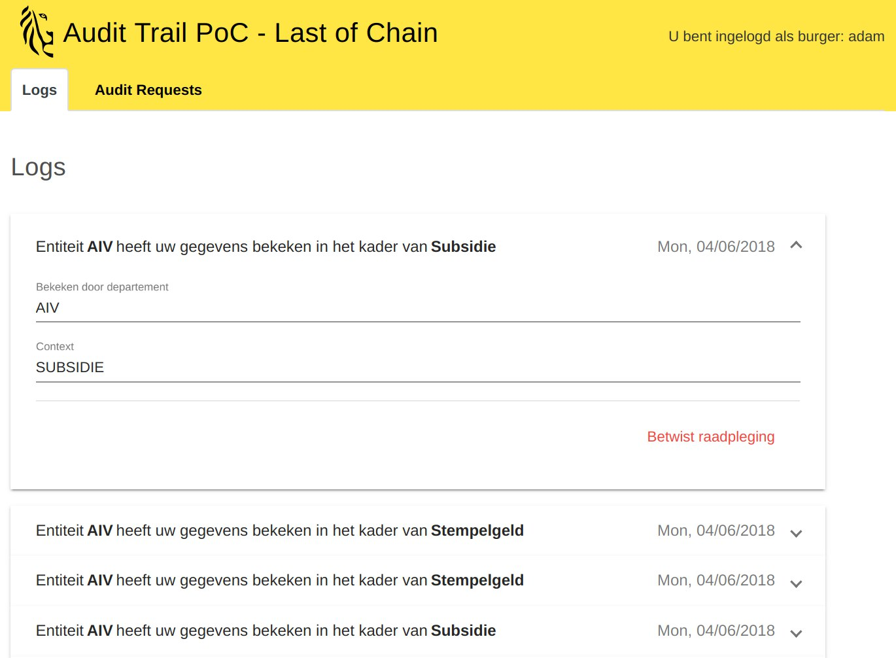

# Audit-trail

**Audit-trail** is a Flemish Government ran Proof-of-Concept (PoC) to demonstrate how early-stage blockchain technologies can be leveraged to make a decentralized and immutable logging-system allowing for:
- Transparent reporting to citizens.
- Disputing government's access behaviour, by citizens.
- Enriched and accurate auditing of logs and disputes.

This project was requested by "Departement Environment", part of the Flemish Government.

## Motivation

The Flemish Government (Vlaamse Overheid) is seeking ways to empower it's citizens with ownership of their personal data. As in other governments, civilian's personal data is usually located in a centralized database. A government process in need of your personal data (your age, your family composition, your tax returns, ...) will access this data and log the access. These access-logs are stored internally for audit purposes. 

The main idea is to make these logs available to citizens in an online portal, allowing citizens to have an idea which of their personal data is being used and in which government process or context. A few applications have been developed allowing for such functionality [MAGDA](https://overheid.vlaanderen.be/magda) and [Burgerprofiel](https://overheid.vlaanderen.be/mijn-burgerprofiel). Both have their strengths and weaknesses. 

With the hype of blockchain being in full swing since 2017, The Flemish Government is investing into innovative blockchain projects to **survey and test** how the technology can help shape the future of data and privacy, building a decentralized, trustless and transparent government.

## Used Technologies in this PoC

- [HyperLedger Composer](https://hyperledger.github.io/composer/latest/)
- [Ethereum](https://www.ethereum.org/)
- [Angular](https://angular.io/)
- [Passport](http://www.passportjs.org/)

## Repository Structure

- **audt-trail-network**: contains the Audit Trail business network model, for HyperLedger Composer
- **audit-trail-app**: contains an angular front-end application allowing for direct communication with the Audit Trail business network through a rest-server
- **rest-server**: rest-server launch scripts

## Architecture

Picture of the architecture, where the rest server is located etc

## Installation and usage

For a TL;DR installation and setup of **Audit-trail**:
1. (Install HyperLedger Composer on your machine)[https://hyperledger.github.io/composer/latest/installing/installing-index.html]
2. (Install and run the **Audit-trail** business network)[./audit-trail-network#deployment-of-the-business-network]
3. (Run the Composer REST server)[rest-server#running-a-single-user-rest-server-development-and-testing]
4. (Run the Angular Front-End application)[]

Furthermore, every folder contains it's own readme with documentation and details regarding the code and motivation behind implementation decisions.
