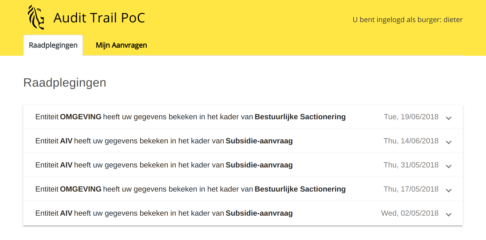
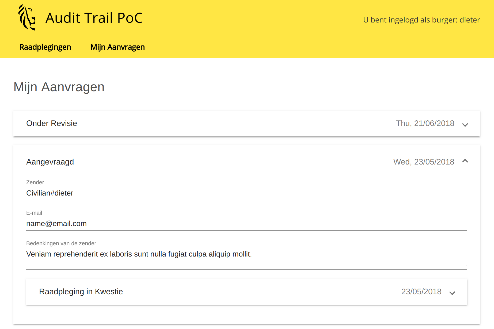
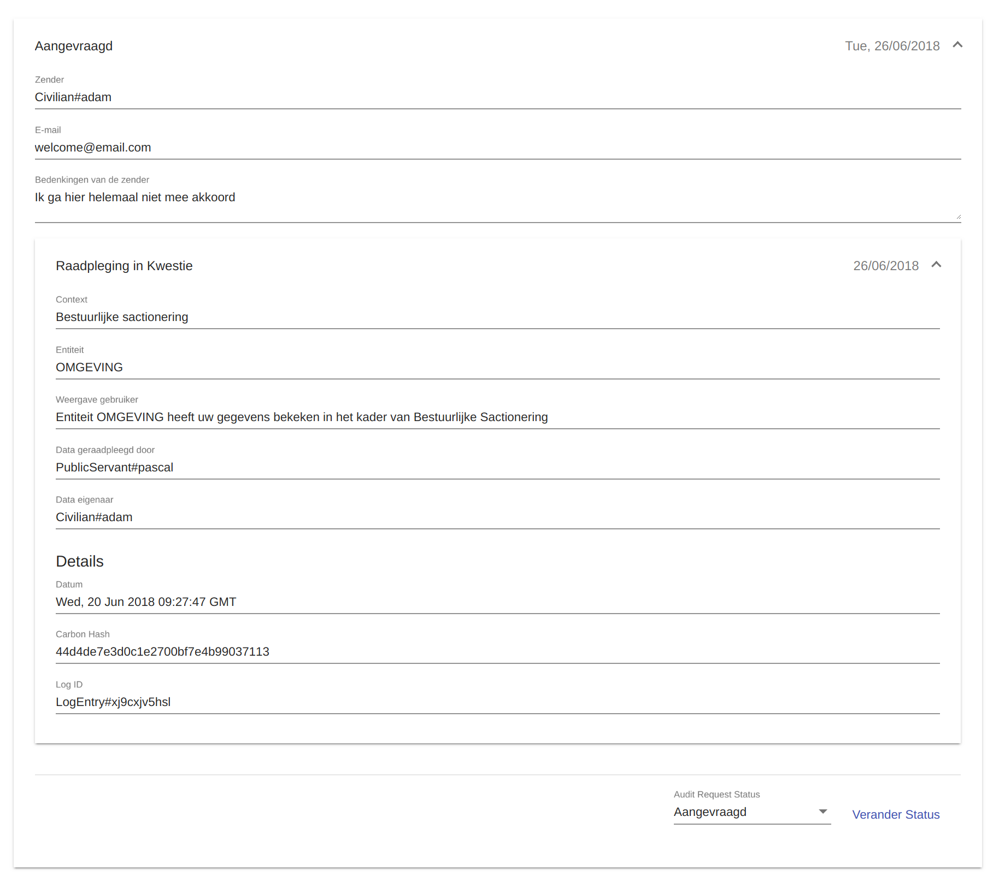

# Audit-Trail Application

This folder contains the front-end application, which uses Angular 6 and the Composer REST server to facilitate interaction with the Audit-trail business network application.

## Running the development server

Run `npm start` for a dev server. Navigate to `http://localhost:4200/`.

The application requires a running HyperLedger Composer node with an installed audit-trail network and running rest-server. For more information on the installation process, [read this section](https://github.com/VO-Blockchain/Audit-trail#installation-and-usage). The rest server is assumed to listen at `https://localhost:3000`. To change these settings, edit `proxy.conf.js`.

## Navigating the application

The Flemish government's processes require citizen's personal data to complete requests or fill in permits. The access to the personal data gets recorded in *logs*. This PoC focuses on exposing the essential information in these logs to the citizens in a front-end application, which fetches the logs from a HyperLedger Fabric blockchain back-end.

### Citizen view

After logging in succesfully, the user is provided with a list of logs which he can review.

Whenever the citizen does not understand why certain data has been accessed, he can **dispute** these by pressing the dispute button. This will open a form allowing for the citizen to reach out to the DPOs (Data Privacy Officers) of the respective entities of the Flemish government, with the option to list a reason for dispute and to leave his/her contact information for follow-up purposes.

Filing a dispute creates an **audit request** which is a document with an attached log, the citizen's complaint and other important information for the DPO. The user can review his audit-request and their state (In Revision, Requested or Done) by clicking on the 'Audit Request' tab, at the top menu of the application.

The audit request overview looks similar to the log-overview. The user can expand an audit request to review its contents and track the progress.

### Auditor view

The auditor has the same views and controls as a citizen user, however the logs and audit-requests he's seeing are the ones generated by public servants within his department.

The auditor is also allowed to see more information within the logs, including a "hash" to a carbon copy log on internal databases and public servant's ID to investigate when and why personal data was accessed.

## Authentication

Authentication occurs through the rest server, but these auth-interactions have not been implemented yet with the front-end application. For the PoC, the goal is to prove the ability to login with multi-user authentication and demonstrate the capabilities of the application using a single-user rest-server mode.
