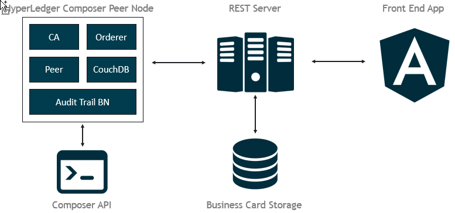

# Composer REST Server

Hyperledger Composer comes with a rest-server which, after providing the business network and business network cards, allows users to manipulate resources on the blockchain network through the REST protocol. The server allows to be ran on a single-user basis (for development) or a multi-user setup. Both will be discussed below.

## Architecture

Above the architecture of the current implementation of **Audit-trail**.  We have a Hyperledger Composer Peer Node running it's essential components and the audit trail business network. This is essentially the blockchain on a single-node
- **CA**: which is the certificate authority
- **Orderer**: which validates transactions and state changes
- **Peer**: which is this node's endpoint
- **CoucbDB**: which contains the ledger
- **Audit Trail BN**: the audit-trail business network.

A user can perform actions on the network, including reading, editting and commiting transactions in 2 ways:
1. Composer API
2. REST-server

The REST-server allows for easy interaction with the blockchain node through a front-end application, in this PoC written in Angular 6.

### Composer API
The Composer API is a node.js API which allows for command-line or node.js based interactions with the blockchain network. In this scenario a user imports his business network cards on his pc, stored in MacOS and Linux operations systems in `~/.composer/cards`. The Composer API will look for these business network cards in the accustomed folder to authenticate and identify the user on the Hyperledger business network.

To learn more about business network cards, read [this section on business network cards](../audit-trail-network#business-network-cards).

### REST Server
The REST server allows users to have these interactions through HTTPS and REST commands, frequently used in front-end applications.

However, the REST server needs to obtain and store the business network card of it's user to authenticate them correctly. This is the `Business Card Storage` in the architecture picture above.

It's really important to understand that the `Business Card Storage` will store all user's business network cards, which if compromised, will allow a malicious intruder to access all identites stored in this storage.

In turn it's important to make the REST-server and the business card storage hardened, or maybe think of a more secure architecture for production purposes.

In the PoC a MongoDB storage hosted at [mlab.com](mlab.com) has been used to store the business network cards.

## Running a Single-User REST Server (Development and testing)
In development one can run the REST server in a single-user mode to test it's functionality.

After finishing the [steps for generating dummy participants, data and identity issueing](../audit-trail-app##dummy-data-populating-the-business-network-with-examples), run the following command to run the server for user `adam`:
~~~~./user-rest-server.sh adam~~~~
The command above assumes a business network card `adam@audit-trail-network` has been installed on the machine.

In the same pattern, to run the REST server in (network) admin mode. run:
~~~~./user-rest-server.sh admin~~~~

After execution, navigate to (http://localhost:3000/explore)[http://localhost:3000/explore] to explore the REST API and it's supported commands.

This step is nessecary for the `audit-trail-app` front-end application to connect to the business network.

## Running a Multi-User REST Server (Production environment)
The REST-Server allows to authenticate multiple users using (Passport)[http://www.passportjs.org/]. If configured correctly, it allows users to authenticate with their facebook, google, github, custom OAUTH2 or even an eID login.

In this PoC, multi-user authentication is implemented for a github sign-in, but (more authentication strategies)[http://www.passportjs.org/packages/] are available.

To run the REST server in a github-based multi-user authentication mode, run the following:
~~~~
./multi-user.sh
~~~~

To change the authentication strategy, or providfe your own github application tokens, one may configure `COMPOSER_DATASOURCES` attributes in `multi-user.sh`.

After running the command, you'll be able to authenticate with your github account on (https://localhost:3000/auth/github)[https://localhost:3000/auth/github]. After logging in, as a user you'll have to upload your `business network card` in the `wallet` endpoint of the REST server. This will match your github authentication with your blockchain identity.

## Notes

- The whole point of a distributed blockchain network is to decentralize authentication and access to citizen's personal data. However, if the REST server together with it's business network card storage are both located in a centralized place, the purpose of the blockchain fades away. A different network architecture needs to proposed to address this issue.
